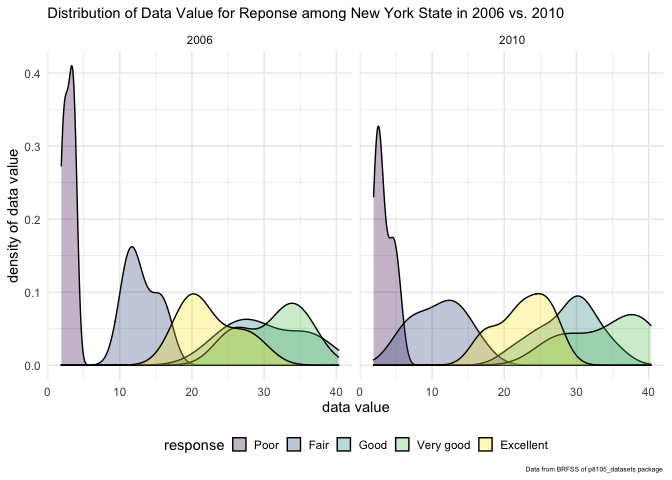
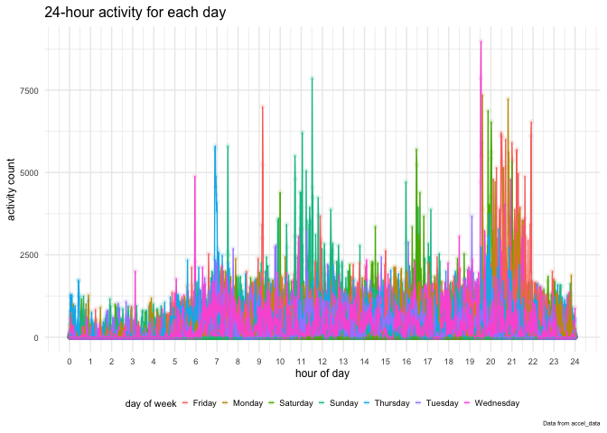

p8105\_hw3\_ry2417
================
Ruiqi Yan
10/12/2021

load `tidyverse` package and set global options of code chunk and figure

``` r
library(tidyverse)

knitr::opts_chunk$set(
  warning = FALSE,
  message = FALSE
)

theme_set(theme_minimal() + theme(legend.position = "bottom"))

options(
  ggplot2.continuous.colour = "turbo",
  ggplot2.continuous.fill = "turbo"
)

scale_colour_discrete = scale_colour_viridis_d(option = "turbo")
scale_fill_discrete = scale_fill_viridis_d(option = "turbo")
```

load `p8105.datasets` package

``` r
library(p8105.datasets)
```

## Problem 1

load `instacart` data and tidy the data to data frame of problem 1

``` r
data("instacart")
p1_df <- 
  instacart %>% 
  mutate(
    order_dow = lubridate::wday(order_dow + 1,
                                label = TRUE,
                                abbr = FALSE
                                )
  ) %>% 
  arrange(user_id, order_number) %>% 
  relocate(user_id, order_number, product_name, aisle, department, everything())
```

Some numerical summary of data

``` r
num_user <-
  p1_df %>% 
  select(user_id) %>% 
  distinct() %>% 
  nrow()

num_order <-
  p1_df %>% 
  select(order_id) %>% 
  distinct() %>% 
  nrow()

num_product <-
  p1_df %>% 
  select(product_name) %>% 
  distinct() %>% 
  nrow()

average_prior_order_day <-
  p1_df %>% 
  group_by(user_id) %>% 
  summarise(
    prior_order_day = sum(days_since_prior_order)/n()
  ) %>% 
  pull(prior_order_day) %>% 
  mean() %>% 
  round()

most_order_dow <-
  p1_df %>% 
  group_by(order_dow) %>% 
  distinct(order_id) %>% 
  summarise(
    num_order = n()
  ) %>% 
  filter(num_order == max(num_order)) %>% 
  pull(order_dow)
  
num_dptm <-
  p1_df %>% 
  select(department) %>% 
  distinct() %>% 
  nrow()

some_dptm <- 
  p1_df %>% 
  select(department) %>% 
  distinct() %>% 
  head(10) %>% 
  pull()

num_aisle <- 
  p1_df %>% 
  select(aisle) %>% 
  distinct() %>% 
  nrow()
  
most_item_aisle <- 
  p1_df %>% 
  group_by(aisle) %>% 
  summarise(
    num_item = n()
  ) %>% 
  arrange(desc(num_item)) %>% 
  head(5) %>% 
  pull(aisle)

most_reorder_product <-
  p1_df %>% 
  group_by(product_name) %>% 
  summarise(
    num_reorder = sum(reordered)
  ) %>% 
  arrange(desc(num_reorder)) %>% 
  head(10) %>% 
  pull(product_name)
```

Some tables generated from data

``` r
example_obs_p1 <-
  p1_df %>% 
  head(10) %>% 
  select(user_id, 
         order_id, 
         product_name, 
         aisle, 
         department,
         order_dow,
         order_hour_of_day
  ) %>% 
  head(10) %>% 
  knitr::kable()

most_popular_product <- 
  p1_df %>% 
  group_by(product_name) %>% 
  distinct(order_id) %>% 
  summarise(
    num_product_order = n()
  ) %>% 
  arrange(desc(num_product_order)) %>% 
  head(10) %>% 
  knitr::kable()

most_popular_product_by_dptm <-
  p1_df %>% 
  group_by(department, product_name) %>% 
  distinct(order_id) %>% 
  summarise(
    num_order = n()
  ) %>% 
  mutate(
    product_rank = min_rank(desc(num_order))
  ) %>% 
  select(-num_order) %>% 
  filter(product_rank < 4) %>% 
  head(18) %>% 
  arrange(product_rank) %>% 
  pivot_wider(
    names_from = product_rank,
    names_prefix = "rank_",
    values_from = product_name
  ) %>% 
  knitr::kable()

most_popular_product_by_aisle <-
  p1_df %>% 
  filter(aisle %in% c("baking ingredients",
                      "dog food care",
                      "packaged vegetables fruits")) %>% 
  group_by(aisle, product_name) %>% 
  summarise(
    num_times = n()
  ) %>% 
  mutate(
    product_rank = min_rank(desc(num_times))
  ) %>% 
  filter(product_rank < 4) %>% 
  arrange(aisle, product_rank) %>% 
  knitr::kable()

mean_hour_of_day_dow <-
  p1_df %>% 
  filter(product_name %in% c("Pink Lady Apples", "Coffee Ice Cream")) %>% 
  group_by(product_name, order_dow) %>% 
  summarise(
    mean_hour_of_day = mean(order_hour_of_day)
  ) %>% 
  pivot_wider(
    names_from = order_dow,
    values_from = mean_hour_of_day
  ) %>% 
  knitr::kable()
```

`instacart`data contains 1384617 observations of 15 variables. The
variables name are
`user_id, order_number, product_name, aisle, department, order_id, product_id, add_to_cart_order, reordered, eval_set, order_dow, order_hour_of_day, days_since_prior_order, aisle_id, department_id`.
There are 131209 users, 131209 orders, 39123 different products, 21
categories of products and 134 aisles . The categories of products
include beverages, dairy eggs, household, snacks, breakfast, deli,
frozen, produce, personal care, canned goods. Most of items were order
aisles `most_item_aisle`. Here are some examples of observations

| user\_id | order\_id | product\_name                    | aisle                  | department | order\_dow | order\_hour\_of\_day |
|---------:|----------:|:---------------------------------|:-----------------------|:-----------|:-----------|---------------------:|
|        1 |   1187899 | Soda                             | soft drinks            | beverages  | Thursday   |                    8 |
|        1 |   1187899 | Organic String Cheese            | packaged cheese        | dairy eggs | Thursday   |                    8 |
|        1 |   1187899 | 0% Greek Strained Yogurt         | yogurt                 | dairy eggs | Thursday   |                    8 |
|        1 |   1187899 | XL Pick-A-Size Paper Towel Rolls | paper goods            | household  | Thursday   |                    8 |
|        1 |   1187899 | Milk Chocolate Almonds           | candy chocolate        | snacks     | Thursday   |                    8 |
|        1 |   1187899 | Pistachios                       | nuts seeds dried fruit | snacks     | Thursday   |                    8 |
|        1 |   1187899 | Cinnamon Toast Crunch            | cereal                 | breakfast  | Thursday   |                    8 |
|        1 |   1187899 | Aged White Cheddar Popcorn       | popcorn jerky          | snacks     | Thursday   |                    8 |
|        1 |   1187899 | Organic Whole Milk               | milk                   | dairy eggs | Thursday   |                    8 |
|        1 |   1187899 | Organic Half & Half              | cream                  | dairy eggs | Thursday   |                    8 |

The products that has most reordering users were Banana, Bag of Organic
Bananas, Organic Strawberries, Organic Baby Spinach, Organic Avocado,
Organic Hass Avocado, Large Lemon, Strawberries, Organic Raspberries,
Limes. Here is the table of the most popular products and the number of
times being ordered

| product\_name          | num\_product\_order |
|:-----------------------|--------------------:|
| Banana                 |               18726 |
| Bag of Organic Bananas |               15480 |
| Organic Strawberries   |               10894 |
| Organic Baby Spinach   |                9784 |
| Large Lemon            |                8135 |
| Organic Avocado        |                7409 |
| Organic Hass Avocado   |                7293 |
| Strawberries           |                6494 |
| Limes                  |                6033 |
| Organic Raspberries    |                5546 |

The three most popular items in each of the aisles “baking ingredients”,
“dog food care”, and “packaged vegetables fruits” are listed here

| aisle                      | product\_name                                 | num\_times | product\_rank |
|:---------------------------|:----------------------------------------------|-----------:|--------------:|
| baking ingredients         | Light Brown Sugar                             |        499 |             1 |
| baking ingredients         | Pure Baking Soda                              |        387 |             2 |
| baking ingredients         | Cane Sugar                                    |        336 |             3 |
| dog food care              | Snack Sticks Chicken & Rice Recipe Dog Treats |         30 |             1 |
| dog food care              | Organix Chicken & Brown Rice Recipe           |         28 |             2 |
| dog food care              | Small Dog Biscuits                            |         26 |             3 |
| packaged vegetables fruits | Organic Baby Spinach                          |       9784 |             1 |
| packaged vegetables fruits | Organic Raspberries                           |       5546 |             2 |
| packaged vegetables fruits | Organic Blueberries                           |       4966 |             3 |

The most popular items in some departments are shown below

| department | rank\_1                                          | rank\_2                               | rank\_3                               |
|:-----------|:-------------------------------------------------|:--------------------------------------|:--------------------------------------|
| alcohol    | Sauvignon Blanc                                  | Cabernet Sauvignon                    | Beer                                  |
| babies     | Baby Food Stage 2 Blueberry Pear & Purple Carrot | Spinach Peas & Pear Stage 2 Baby Food | Gluten Free SpongeBob Spinach Littles |
| bakery     | 100% Whole Wheat Bread                           | Organic Bread with 21 Whole Grains    | Sourdough Bread                       |
| beverages  | Sparkling Water Grapefruit                       | Spring Water                          | Lime Sparkling Water                  |
| breakfast  | Honey Nut Cheerios                               | Organic Old Fashioned Rolled Oats     | Raisin Bran Cereal                    |
| bulk       | Dried Mango                                      | Organic Rolled Oats                   | Organic Black Mission Figs            |

The day of the week when most orders were placed is Sunday. The average
days since prior order per user are 17 days.  
The table showing the mean hour of the day at which Pink Lady Apples and
Coffee Ice Cream are ordered on each day of the week is

| product\_name    |   Sunday |   Monday |  Tuesday | Wednesday | Thursday |   Friday | Saturday |
|:-----------------|---------:|---------:|---------:|----------:|---------:|---------:|---------:|
| Coffee Ice Cream | 13.77419 | 14.31579 | 15.38095 |  15.31818 | 15.21739 | 12.26316 | 13.83333 |
| Pink Lady Apples | 13.44118 | 11.36000 | 11.70213 |  14.25000 | 11.55172 | 12.78431 | 11.93750 |

Make a plot that shows the number of items ordered in each aisle,
limiting this to aisles with more than 10000 items ordered.

``` r
p1_df %>% 
  group_by(aisle) %>% 
  summarise(
    num_item = n()
  ) %>% 
  filter(num_item >= 10000) %>% 
  ggplot(aes(x = aisle, y = num_item)) +
  geom_bar(stat = "identity", alpha = 0.5) +
  labs(x = "aisle name",
       y = "number of items ordered",
       title = "The Number of Items Ordered in Each Aisle(>= 10000)",
       caption = "Data from instacart of p8105_datasets package ") +
  theme(
    axis.text.x = element_text(size = 8),
    axis.text.y = element_text(size = 8),
    axis.title = element_text(size = 10),
    plot.title = element_text(size = 10),
    plot.caption = element_text(size = 5)
  ) +
  coord_flip()
```

<!-- -->

## Problem 2

load `brfss_smart2010` data

``` r
data("brfss_smart2010")
```

clean `brfss_smart2010` data and assign to data frame of problem 2

``` r
p2_df <- 
  brfss_smart2010 %>% 
  janitor::clean_names() %>% 
  rename(
    state = locationabbr,
    location = locationdesc
  ) %>% 
  filter(topic == "Overall Health") %>% 
  mutate(
    response = factor(response, 
                      levels = c("Poor", 
                                 "Fair",
                                 "Good",
                                 "Very good",
                                 "Excellent"),
                      ordered = TRUE
                      )
  )
```

``` r
state_7_more_2002 <-
  p2_df %>% 
  filter(year == 2002) %>% 
  group_by(state) %>% 
  distinct(location) %>% 
  summarise(num_location = n()) %>% 
  filter(num_location >= 7) %>% 
  pull(state)

state_7_more_2010 <-
  p2_df %>% 
  filter(year == 2010) %>% 
  group_by(state) %>% 
  distinct(location) %>% 
  summarise(num_location = n()) %>% 
  filter(num_location >= 7) %>% 
  pull(state)
```

In 2002, states that were observed at 7 or more locations are CT, FL,
MA, NC, NJ, PA. In 2010, states that were observed at 7 or more
locations are CA, CO, FL, MA, MD, NC, NE, NJ, NY, OH, PA, SC, TX, WA.

Make a “spaghetti” plot of the average data value over time within a
state

``` r
excellent_df <- 
  p2_df %>% 
  filter(response == "Excellent") %>% 
  group_by(state, year) %>% 
  summarise(
    mean_data_value = mean(data_value, na.rm = TRUE)
  )
excellent_df %>% 
  ggplot(aes(x = year, y = mean_data_value, color = state)) +
  geom_line(alpha = 0.5) +
  labs(
    y = "average data value",
    title = "Average Value over Time within Each States",
    caption = "Data from BRFSS of p8105_datasets package "
  ) +
  theme(
    plot.caption = element_text(size = 5),
    legend.key.size = unit(0.4, "cm"),
    legend.text = element_text(size = 5)
  ) +
  guides(color = guide_legend(nrow = 4))
```

<!-- -->

Make a two-panel plot showing, for the years 2006, and 2010,
distribution of data\_value for responses (“Poor” to “Excellent”) among
locations in NY State

``` r
p2_df %>% 
  filter(year %in% c(2006, 2010), state == "NY") %>% 
  ggplot(aes(x = data_value, fill = response)) +
  geom_density(alpha = .3) +
  facet_grid(. ~ year) +
  labs(y = "density of data value",
       x = "data value",
    title = "Distribution of Data Value for Reponse among New York State in 2006 vs. 2010",
    caption = "Data from BRFSS of p8105_datasets package ") +
  theme(
    plot.title = element_text(size = 11),
    plot.caption = element_text(size = 5),
    legend.key.size = unit(0.4, "cm")
  )
```

<!-- -->

## Problem 3

import and clean data set for problem 3 from data `accel_data`

``` r
p3_df <- 
  read_csv(
    "data/accel_data.csv"
  ) %>% 
  janitor::clean_names() %>% 
  rename(
    day_of_week = day,
    day = day_id
  ) %>% 
  pivot_longer( 
    starts_with("activity_"),
    names_to = "minute_of_day",
    names_prefix = "activity_",
    values_to = "activity_in_minute"
  ) %>% 
  mutate(
    minute_of_day = as.numeric(minute_of_day),
    week_vs_weekend = ifelse(day %in% c("Sunday", "Saturday"), "weekend", "week")
  )
```

Some numerical descriptions of data

``` r
average_activity <-
  p3_df %>% 
  pull(activity_in_minute) %>% 
  mean()

example_obs_p3 <-
  p3_df %>% 
  head(10) %>% 
  knitr::kable()
```

There are 50400 observations of 6 variables in data. Each observation is
the observation of one minute collected on a 63 year-old male. The
variables include week, day, day\_of\_week, minute\_of\_day,
activity\_in\_minute, week\_vs\_weekend. The average activity count per
minute is 267.0440592. Here is the examples of some observations

| week | day | day\_of\_week | minute\_of\_day | activity\_in\_minute | week\_vs\_weekend |
|-----:|----:|:--------------|----------------:|---------------------:|:------------------|
|    1 |   1 | Friday        |               1 |             88.37778 | week              |
|    1 |   1 | Friday        |               2 |             82.24444 | week              |
|    1 |   1 | Friday        |               3 |             64.44444 | week              |
|    1 |   1 | Friday        |               4 |             70.04444 | week              |
|    1 |   1 | Friday        |               5 |             75.04444 | week              |
|    1 |   1 | Friday        |               6 |             66.26667 | week              |
|    1 |   1 | Friday        |               7 |             53.75556 | week              |
|    1 |   1 | Friday        |               8 |             47.84444 | week              |
|    1 |   1 | Friday        |               9 |             55.46667 | week              |
|    1 |   1 | Friday        |              10 |             42.95556 | week              |

create a table showing a total activity variable for each day across
minutes

``` r
p3_df %>% 
  group_by(day) %>% 
  summarise(
    activity_in_day = sum(activity_in_minute)
  ) %>% 
  knitr::kable()
```

| day | activity\_in\_day |
|----:|------------------:|
|   1 |         480542.62 |
|   2 |          78828.07 |
|   3 |         376254.00 |
|   4 |         631105.00 |
|   5 |         355923.64 |
|   6 |         307094.24 |
|   7 |         340115.01 |
|   8 |         568839.00 |
|   9 |         295431.00 |
|  10 |         607175.00 |
|  11 |         422018.00 |
|  12 |         474048.00 |
|  13 |         423245.00 |
|  14 |         440962.00 |
|  15 |         467420.00 |
|  16 |         685910.00 |
|  17 |         382928.00 |
|  18 |         467052.00 |
|  19 |         371230.00 |
|  20 |         381507.00 |
|  21 |         468869.00 |
|  22 |         154049.00 |
|  23 |         409450.00 |
|  24 |           1440.00 |
|  25 |         260617.00 |
|  26 |         340291.00 |
|  27 |         319568.00 |
|  28 |         434460.00 |
|  29 |         620860.00 |
|  30 |         389080.00 |
|  31 |           1440.00 |
|  32 |         138421.00 |
|  33 |         549658.00 |
|  34 |         367824.00 |
|  35 |         445366.00 |

Day2, day24 and day31 have the total activities that much lower than
other days.  

Make a single-panel plot that shows the 24-hour activity time courses
for each day and use color to indicate day of the week.

``` r
p3_df %>% 
  mutate(
    hour_of_day = minute_of_day/60
  ) %>% 
  ggplot(aes(x = hour_of_day, 
             y = activity_in_minute, 
             group = day, 
             color = day_of_week)) +
  geom_point(alpha = .1) +
  geom_line() +
  labs(y = "activity count",
       x = "hour of day",
    title = "24-hour activity for each day ",
    caption = "Data from accel_data",
    colour = "day of week") +
  scale_x_continuous(
    breaks = 0:24
  ) +
  theme(
    axis.text.x = element_text(size = 7),
    axis.text.y = element_text(size = 7),
    axis.title = element_text(size = 9),
    plot.title = element_text(size = 12),
    plot.caption = element_text(size = 5),
    legend.title = element_text(size = 8),
    legend.text = element_text(size = 7),
    legend.key.size = unit(0.2, "cm")
  ) +
  guides(color = guide_legend(nrow = 1))
```

<!-- -->

From the plot, we can see that activity is extremely high during 7pm to
10pm and moderately high between 6am to 12pm and 4pm to 5pm. The overall
activity is more stable and lower on Tuesday than other days of week.
There are high activity in the afternoon and evening on Friday and
Saturday. The activity of Sunday is concentrated between 11am to 12 pm.
